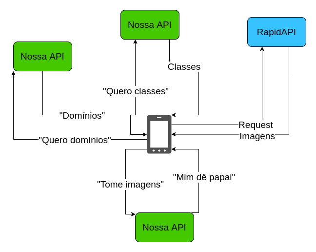

## Image Labeling System - Android
This is the API side of a project created to facilitate the __data acquisition__ and the __data labelling__ steps for supervised computer vision tasks. You just need to create an image __Domain__ and its __Classes__. Each class contain a name and description, and every imagem instance has a reference to a class. The requested images will be shown to the user and with just one click he'll be able to label the image as belonging to the respective class or not.

### Simplified architecture

### Usage description
- In the device the user fills the form for __imagem domain__ creation, e.g. 'cats and dogs';
- The device send the __image domain__ object to the __Ruby API__ ([Code Here](https://github.com/MaximoDouglas/image-labeling-api)), which will use it to use to store related images;
- Once the __image domain__ is created, the user may see it on domains screen of the app;
- Accessing the __image domain__, the user can now create the classes for this domain, if there's not classes created for this domain;
- Once the user creates the classes, the device send it to the __Ruby API__, which will request image URLs for this classes from the __Google Images API__ and save them in the database;
- With the image URLs for the classes saved in the __Ruby API__, the user can now select a class to start the labeling proccess;
- If there's already image URLs in the __Ruby API__ for the user to classify, he will see the images in a screen with two buttons:
  - __Discard__: which will discard this image if it does not belong to the class the user is labeling;
  - __OK__: which confirms that this image belongs to the class being labeled.
- Once the user is done, he can simply press return. 
