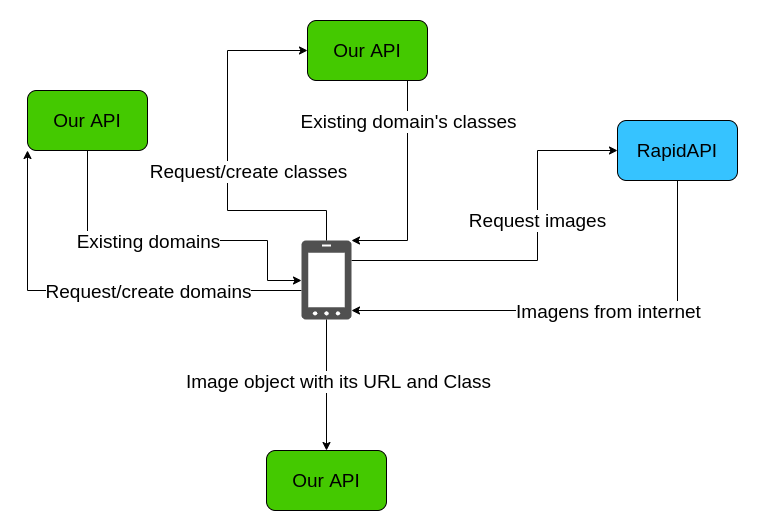

## Image Labeling System - API
This is the API side of a project created to facilitate the __data acquisition__ and the __data labelling__ steps for supervised computer vision tasks. 

You just need to create an image __Domain__ (e.g. **animal**) and its __Classes__ (e.g. **Dog**, **Cat** and **Duck**). As the user select one class, he is taken to the image classification screen and, with just one click, he will be able to label the image as belonging to the respective class or discard it.

### Simplified architecture

### Usage description
- In the **Android app** ([Code Here](https://github.com/MaximoDouglas/image-labeling-android)) home screen, you can select a __imagem domain__ or create a new one (e.g. **animal**);
- If you choose to create a new domain:
  - The device send the __image domain__ object to this API;
- By selecting an __image domain__ in the home screen, you will lead to the __image domain__ details screen, in which, you will be able to create a new __image class__ for this __image domain__ or select an existing one;
- If you choose to create a new domain:
  - The device send the __image class__ object to this API;
- By selecting a __image class__, you will be redirected to the image classification screen, where the magic happens;
- In the classification screen, the you will be able to edit the __image class__ details as well as to input an search term that will be used to request images from the RapidAPI API;
- Once you type a search term and hit the search button (this can be done at anytime you want), the app will request images from the RapidAPI that matches this search term;
- The images will be shown in the screen together with two buttons:
  - Dicard, that will do nothing besides passing to the next image;
  - Confirm, that will confirme that the shown image belongs to the __image class__ you are working on - which means that the app will send to this API an Image object that contains the image URL and its label;
- Once the labeling task is complete for this class, you can now go back to the domain detail screen and select another class to label images with just one click;
- If you have finished labeling for this image domain, you can go back to the home screen and select or create new __image domain__ to label its images.
